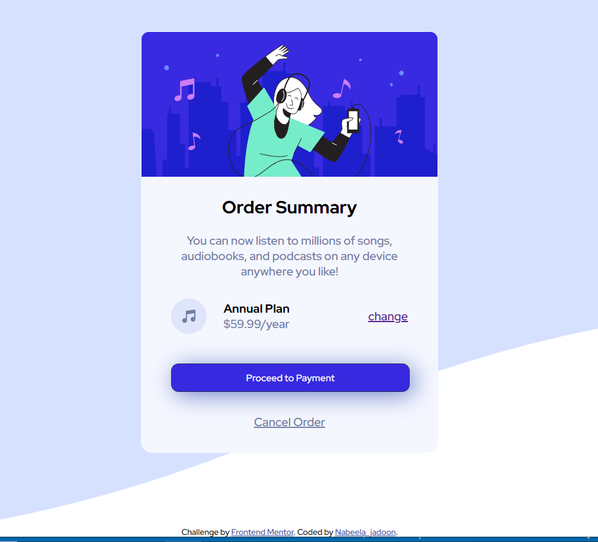

# Frontend Mentor - Order summary card solution

## Overview
This is a solution to the [Order summary card challenge on Frontend Mentor](https://www.frontendmentor.io/challenges/order-summary-component-QlPmajDUj). Frontend Mentor challenges help you improve your coding skills by building realistic projects. 
  
### The challenge

Users should be able to:

- See hover states for interactive elements

### Screenshot

### Links

- Solution URL: (https://github.com/nabeela-s/Challange-orderSummary-webDesign.git)
- Live Site URL: (https://reliable-cactus-7b5ff5.netlify.app/)

## My process

### Built with

- Semantic HTML5 markup
- CSS custom properties
- Flexbox
